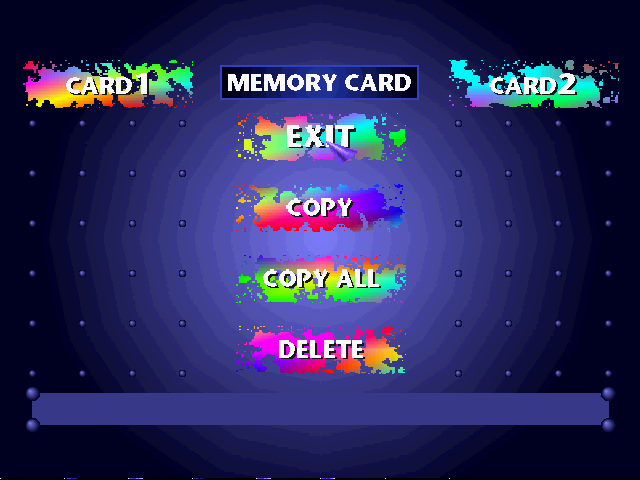

# PSX

[](spec/)
[](LICENSE)

A work-in-progress PlayStation 1 emulator written in pure Ruby.

It boots the SCPH1001 BIOS into the **Memory Card / CD-ROM shell**, reads
`.bin`/`.cue` disc images, and runs real retail discs end-to-end through
the BIOS license check (no patching). MDEC is wired up through Phase 3
(RLC + dequant + IDCT + YCbCr). Save states (F5/F8 in the SDL window)
round-trip the full machine state. SPU audio is still early but now mixes
basic ADPCM voices plus CDDA/CD-XA through the SPU path. There is no PGXP,
and many retail games still hit content-specific blockers (FMV codec init,
timing-sensitive CD paths), so don't expect to play full games yet.
Think of it as an executable spec for the PS1. 414/414 unit tests,
18/21 of the [JaCzekanski/ps1-tests](https://github.com/JaCzekanski/ps1-tests)
cases that have a `psx.log` reference.



## Install

```sh
gem install psx
```

You will also need SDL2 on your system (the gem depends on `ruby-sdl2`):

- macOS: `brew install sdl2`
- Debian / Ubuntu: `sudo apt install libsdl2-dev`
- Arch: `sudo pacman -S sdl2`

## Usage

You must supply your own BIOS ROM (typically `SCPH1001.BIN`, 512 KB). PSX
does not ship one — BIOS images are copyrighted.

```sh
psx path/to/SCPH1001.BIN                          # BIOS shell only
psx path/to/SCPH1001.BIN game.cue                 # with a disc inserted
psx --fast-boot path/to/SCPH1001.BIN homebrew.bin # skip license check
```

`--fast-boot` skips the BIOS shell and license screen, reads `SYSTEM.CNF`
+ the PS-EXE straight out of the disc's ISO9660 filesystem, and jumps to
the EXE's entry point after the BIOS kernel has finished init. Required
for synthetic / homebrew discs that don't carry a Sony license image.

Run `psx --help` for the option list. Keyboard controls (slot 1 digital pad):

| Key            | Button   |
| -------------- | -------- |
| Arrow keys     | D-pad    |
| Z              | Cross    |
| X              | Circle   |
| A              | Square   |
| S              | Triangle |
| Enter          | Start    |
| Space          | Select   |
| Q / W          | L1 / R1  |
| E / R          | L2 / R2  |
| F5             | Quicksave to `tmp/quicksave.psxstate` |
| F8             | Quickload from `tmp/quicksave.psxstate` |
| Escape         | Quit     |

The BIOS shell idles on the Sony logo until you press Triangle, which opens
the Memory Card / CD-ROM menu. Set `PSX_QUICKSAVE=path.psxstate` to point
F5 / F8 elsewhere.

## Programmatic use

```ruby
require "psx"

# BIOS shell only
emu = PSX::Emulator.new("SCPH1001.BIN")
emu.run(steps: 300_000_000)
emu.controller_state_proc = -> { 0xEFFF }    # press Triangle
emu.run(steps: 30_000_000)
emu.save_screenshot("menu.ppm")

# Fast-boot a PS-EXE from a CD image
emu = PSX::Emulator.new("SCPH1001.BIN", disc_path: "homebrew.cue")
emu.fast_boot_from_disc                       # loads the PS-EXE listed in SYSTEM.CNF
emu.run(steps: 50_000_000)
```

The emulator exposes the major components individually: `emu.cpu`,
`emu.memory`, `emu.gpu`, `emu.dma`, `emu.cdrom`, `emu.sio0`, `emu.interrupts`,
`emu.timers`, `emu.spu`, `emu.mdec`. Save/restore the whole machine with
`emu.save_state("scene.psxstate")` / `PSX::Emulator.from_state(path, bios:, disc:)`.

## Development

```sh
git clone https://github.com/khasinski/psx
cd psx
bundle install
bundle exec rake test
```

The `bin/` directory contains development tools that are *not* shipped with
the gem.

Runners and test harnesses:

| Script                   | Purpose                                                                 |
| ------------------------ | ----------------------------------------------------------------------- |
| `bin/psx-ruby`           | Headless boot of the BIOS (no SDL window).                              |
| `bin/psx-test`           | Run a PS-EXE on top of the BIOS, diff against ps1-tests reference logs. |
| `bin/psx-conformance`    | Run the amidog CPU/CPx/GPU/GTE conformance tests, tally per-subtest pass/fail. |
| `bin/psx-amidog-smoke`   | Boot every amidog test, check it reaches its startup banner.            |
| `bin/build-test-disc`    | Wrap a PS-EXE in a minimal MODE2/2352 disc image (needs mkisofs).       |
| `bin/fetch-amidog-tests` | Download and unpack the amidog test suite into `.tests-amidog/`.        |
| `bin/fetch-redux-tests`  | Sparse-clone PCSX-Redux's `src/mips/` into `.tests-redux/`.             |
| `bin/_ps1tests-baseline` | Run the JaCzekanski ps1-tests baseline and print pass/fail tally.       |

Tracing and inspection:

| Script                | Purpose                                                                 |
| --------------------- | ----------------------------------------------------------------------- |
| `bin/psx-trace`       | PC histogram + I_STAT/I_MASK summary at checkpoints.                    |
| `bin/psx-disasm`      | Disassemble a range of physical addresses after N cycles of boot.       |
| `bin/psx-biostrace`   | Tally A/B/C jump-table calls; dump the last N calls.                    |
| `bin/psx-puts-trace`  | Capture the kernel's debug TTY (`puts2`, `printf`, …).                  |
| `bin/psx-memwatch`    | Log reads/writes to specific addresses with the PC that did them.       |
| `bin/psx-dumpmem`     | Hex-dump a range of memory after N cycles of boot.                      |
| `bin/psx-smoke`       | Boot the BIOS and dump PPM screenshots at intervals.                    |

Benchmarks, save states, and game-specific drivers:

| Script                  | Purpose                                                                 |
| ----------------------- | ----------------------------------------------------------------------- |
| `bin/_psx-bench`        | Headless throughput bench (cycles/sec) on the BIOS boot path.           |
| `bin/_psx-state-bench`  | Bench forward from a `.psxstate` snapshot (skip BIOS-boot replay).      |
| `bin/_psx-makestate`    | Build a `.psxstate` snapshot from a fresh BIOS-boot + N cycles.         |
| `bin/_psx-bootmap`      | Flame graph + ASCII histogram of where time goes during BIOS boot.      |
| `bin/_psx-profile`      | stackprof a BIOS-boot run, flat report.                                 |
| `bin/_psx-gtebench`     | Synthetic GTE micro-bench in a tight Ruby loop.                         |
| `bin/_psx-gteprofile`   | stackprof the GTE bench.                                                |
| `bin/_psx-exe-display`  | Boot BIOS then load a PS-EXE into the SDL window (for visual GPU tests).|
| `bin/_gte-timing-shot`  | Render amidog `psxtest_gte` long enough for the OFFICIAL.TIMING block.  |
| `bin/_ridge-boot`       | Headless boot of Ridge Racer (EU) with periodic PPM screenshots.        |

### Running test suites

Three test corpora are wired in; all live under `.tests*/` (gitignored).

**JaCzekanski/ps1-tests** — pass/fail style, with reference `psx.log` files.

```sh
git clone https://github.com/JaCzekanski/ps1-tests.git .tests
bundle exec ruby bin/psx-test -e .tests/cpu/cop/psx.log .tests/cpu/cop/cop.exe
```

**amidog test programs** (https://psx.amidog.se) — CPU/GPU/GTE conformance
plus a few weird-edge demos. Several ship as proper MODE2/2352 `.bin`/`.cue`
discs with real Sony license sectors, so they exercise the CD-boot path.

```sh
bundle exec ruby bin/fetch-amidog-tests           # one-time download
bundle exec ruby bin/psx-amidog-smoke             # boot-and-banner check
```

**PCSX-Redux** (https://github.com/grumpycoders/pcsx-redux) — source-only.
Sparse-clones `src/mips/` (OpenBIOS, in-tree tests, demos). Building the
PS-EXEs needs a MIPS cross-toolchain — see `src/mips/README.md` inside the
clone for instructions. Useful as a reference for hardware behaviour even
without building.

```sh
bundle exec ruby bin/fetch-redux-tests
```

## Status

What works:

- MIPS R3000A CPU with delay slots, exceptions, COP0, branch-target
  handling, load-delay slots
- GTE (passes `gte/test-all`, nocash per-opcode timing through Timer 2
  sysclock; some coverage gaps)
- GPU: GP0 polygons / lines / rectangles, textured / shaded / semi-transparent
  primitives, CPU↔VRAM blits, mask bit. Software rasteriser, no PGXP.
- DMA channels for OTC, GPU (block / linked list), SPU, CD-ROM, MDEC in/out
- Interrupt controller, root counters (Timer 0/1/2 with sysclock / dotclock /
  hblank sources)
- CD-ROM controller backed by `.bin`/`.cue` images, with SetLoc / ReadN /
  ReadS / Pause / SeekL / GetlocL / GetTN / GetTD / GetID / Init / SetMode
  (including `whole_sector` bit-5 mode for CD-XA reads) and cycle-paced
  INT1 sector delivery
- ISO9660 reader for SYSTEM.CNF + PS-EXE extraction
- BIOS shell boots real retail discs end-to-end via the license check,
  no patching required (`--fast-boot` is still available for synthetic
  / homebrew discs)
- SIO0 digital pad (slot 1)
- SPU: register window read-back, RAM DMA/FIFO transfers, IRQ9 RAM checks,
  ADPCM block decode, Gaussian voice interpolation, basic voice stepping/ADSR,
  basic pitch modulation,
  fixed/current volume registers, basic volume sweep, noise voices, basic
  DuckStation/Mednafen-style reverb work-buffer processing, SPUCNT mute,
  capture buffers, CDDA/CD-XA queue mixing, and stereo PCM output. Full ADSR
  conformance and full audio conformance are still open.
- MDEC: register surface (Phase 1), quant + IDCT tables and DMA 0/1
  ingress / egress (Phase 2), real RLC + dequant + IDCT + YCbCr → RGB
  decoder (Phase 3). DMA1 completion IRQ wired. CD-XA sectors decode
  and feed the SPU CD-audio path.
- Save states: F5 / F8 in the SDL window quicksave / quickload, full
  machine round-trip via `Marshal` (CPU + GTE + COP0 + RAM + GPU VRAM +
  SPU + MDEC + CD-ROM + timers + interrupts).
- Symmetric upper-RAM mirror (matches real hardware — writes to
  `0x80200000+` alias back to the populated 2 MB chip).
- Bus-error on instruction fetch from forbidden regions (scratchpad,
  IRQ, MDEC, timers, JOY/SIO); fetch from DMA / SPU / GPU register
  space goes through (matches real hardware)
- 414/414 unit tests pass.
- JaCzekanski/ps1-tests baseline passes for the checked non-CD-ROM
  cases (`TOTAL 18  OK 18  FAIL 0`). CD-ROM ps1-tests are run
  separately with a disc image via `PSX_TEST_DISC` and currently pass
  (`TOTAL 3  OK 3  FAIL 0`).
- Rage Racer Europe boots through the intro FMV to the title screen,
  accepts a Start edge on the title screen, and reaches the in-engine
  attract/race scene in the current smoke tests.

What doesn't:

- SPU audio is incomplete: the reverb path now follows the DuckStation /
  Mednafen work-buffer structure but still needs broader conformance testing;
  ADSR is not conformance-grade yet, and noise/pitch modulation still need
  broader conformance testing.
- DMA timing isn't cycle-accurate. GPU block DMA now keeps CHCR busy for a
  DuckStation-style RAM access delay and manual chopping adds a capped CPU
  window delay, but `dma/chopping` is still not bit-perfect against real
  hardware.
- GPU, CD-ROM, and MDEC timing are still approximate in places even where
  structural conformance tests pass.

## License

MIT. See [LICENSE](LICENSE).
